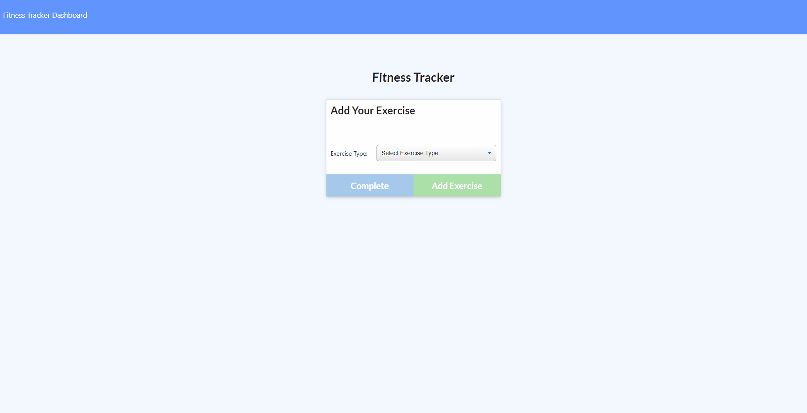

# Workout_Tracker
[Link to Heroku Deployment](https://infinite-cove-38887.herokuapp.com/)

## Description
This application is a simple full stack development CRUD application. The backend is impleneted with Node.js and Express. The database was constructed with Mongoose and MongoDB.

THis app allows a user to track their daily workouts, including cardio and resistance workouts, as well as details about the workout such as duration, sets, reps, and amount of weight used. Analytics about the the workouts over the course of the week are displayed on a separate stats page.

## Tech Stack
-HTML 5
-CSS 3
-Node.js
-Express NPM
-MongoDB
-Heroku

## License

This application is covered under the MIT license.

## Credits

This project was based on a homework assignment through Trilogy Education Services.

## Questions

If you have further questions, please email me at nckoller@gmail.com.
